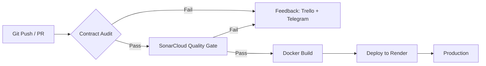

<!-- Improved compatibility of back to top link: See: https://github.com/othneildrew/Best-README-Template/pull/73 -->
<a id="readme-top"></a>

<!-- PROJECT SHIELDS -->
[![Contributors][contributors-shield]][contributors-url]
[![Forks][forks-shield]][forks-url]
[![Stargazers][stars-shield]][stars-url]
[![Issues][issues-shield]][issues-url]
[![Semaphore CI][semaphore-shield]][semaphore-url]
[![SonarCloud][sonarcloud-shield]][sonarcloud-url]
[![LinkedIn][linkedin-shield]][linkedin-url]

<!-- PROJECT LOGO -->
<br />
<div align="center">
  <h3 align="center">MINOLI</h3>

  <p align="center">
    Continuous Integration · Continuous Delivery
    <br />
    <a href="https://goya-2do-parcial.onrender.com/"><strong>View Live Demo »</strong></a>
  </p>
</div>

<!-- TABLE OF CONTENTS -->
<details>
  <summary>Table of Contents</summary>
  <ol>
    <li>
      <a href="#about-the-project">About The Project</a>
      <ul>
        <li><a href="#built-with">Built With</a></li>
      </ul>
    </li>
    <li>
      <a href="#getting-started">Getting Started</a>
      <ul>
        <li><a href="#prerequisites">Prerequisites</a></li>
        <li><a href="#installation">Installation</a></li>
      </ul>
    </li>
    <li><a href="#usage">Usage</a></li>
    <li><a href="#ci-cd-pipeline">CI/CD Pipeline</a></li>
    <li><a href="#contributing">Contributing</a></li>
    <li><a href="#license">License</a></li>
    <li><a href="#contact">Contact</a></li>
    <li><a href="#acknowledgments">Acknowledgments</a></li>
  </ol>
</details>

<!-- ABOUT THE PROJECT -->
## About The Project

This repository contains the practical implementation required for the second evaluation instance of **Continuous Integration and Continuous Delivery** in the *Software Engineering and Quality* course at Universidad Tecnológica Nacional (UTN).

The project applies CI/CD concepts and tools in a real software development workflow. The architecture reflects the practice of integrating changes into a shared repository frequently and automatically, enabling rapid error detection, improved code quality, and accelerated delivery.

### Architecture & Components

The CI/CD environment was built by configuring the following core components:

* **Version Control:** Centralized code management via Git and GitHub, using a feature-branch strategy with `main` branch protection through Pull Requests.
* **CI Server:** Build pipeline and automated test execution orchestrated through **Semaphore CI**.
* **Contract Validation:** Automated tests verify the HTML output strictly matches the expected contract on every pipeline run.
* **Spec-Driven Development (SDD):** When a contract is broken, Gemini AI analyzes the failure against the quality requirements (`docs/requirements.md`) and generates a structured fix plan — the specification drives the recommended solution.
* **Code Quality Inspection:** Static analysis and quality gates enforced by **SonarCloud**.
* **Environment Management:** Containerization with **Docker** (Nginx Alpine image) for isolated and reproducible execution environments.
* **Delivery Environment:** Automated continuous deployment configured on **Render**, connecting CI server validation directly to production release.
* **Feedback Mechanism:** Pipeline results broadcast to the team via **Trello** (card updates) and **Telegram** (instant notifications), with **Gemini AI** assisting in failure analysis.

<p align="right">(<a href="#readme-top">back to top</a>)</p>

### Built With

[![Git][Git]][Git-url]
[![GitHub][GitHub]][GitHub-url]
[![Semaphore CI][Semaphore]][Semaphore-url]
[![Docker][Docker]][Docker-url]
[![Nginx][Nginx]][Nginx-url]
[![SonarCloud][SonarCloud]][SonarCloud-url]
[![Render][Render]][Render-url]
[![Trello][Trello]][Trello-url]
[![Telegram][Telegram]][Telegram-url]
[![Gemini][Gemini]][Gemini-url]

<p align="right">(<a href="#readme-top">back to top</a>)</p>

<!-- GETTING STARTED -->
## Getting Started

To get a local copy up and running, follow these simple steps.

### Prerequisites

* Docker
  ```sh
  # Verify Docker is installed
  docker --version
  ```

### Installation

1. Clone the repo
   ```sh
   git clone https://github.com/ManuCaneva/2DO-PARCIAL---CI-CD.git
   ```
2. Build the Docker image
   ```sh
   make build
   ```
3. Run the spec kit tests locally
   ```sh
   make test
   ```
4. Start the server
   ```sh
   make run
   ```
5. Open [http://localhost:8080](http://localhost:8080)

### Make Commands

| Command | Description |
|---|---|
| `make build` | Build the local Docker image |
| `make test` | Run the automated spec kit test |
| `make run` | Start the server at http://localhost:8080 |
| `make stop` | Stop the running container |
| `make all` | Run build + test (full local pipeline) |

<p align="right">(<a href="#readme-top">back to top</a>)</p>

<!-- USAGE EXAMPLES -->
## Usage

Once the server is running, visit `http://localhost:8080` to see the MINOLI landing page, which displays the current CI/CD pipeline status.

The latest stable and CI-validated version is also deployed automatically at:
**https://goya-2do-parcial.onrender.com/**

Every push or Pull Request to any branch triggers the full pipeline on Semaphore CI, which runs contract validation, code quality analysis, and Docker build verification. Automated deployment to Render, however, only occurs when changes are merged into `main` via a Pull Request — direct pushes to `main` are blocked by branch protection rules.

<p align="right">(<a href="#readme-top">back to top</a>)</p>

<!-- CI/CD PIPELINE -->
## CI/CD Pipeline

The automated pipeline enforces strict auditing on every code change before it reaches production:

1. **Contract Audit (SDD):** The CI server executes the spec kit validation scripts. If the test fails, the pipeline aborts immediately, blocking integration and triggering alerts via Trello and Telegram.
2. **Code Quality Inspection:** **SonarCloud** analyzes the codebase for bugs, code smells, and duplications. The pipeline only proceeds if the Quality Gate passes.
3. **Docker Build Validation:** Once the previous stages pass, the pipeline compiles the Docker container, ensuring a clean and error-free image.
4. **Continuous Deployment:** After the validated code is merged into `main`, **Render** automatically deploys the new image, keeping the delivery cycle stable and hands-free.



> **Note:** The pipeline runs on **every branch**. Deployment to Render is exclusive to `main` and only happens after a Pull Request merge. Direct pushes to `main` are disabled — branch protection requires all changes to go through Pull Requests with at least one approval.

<p align="right">(<a href="#readme-top">back to top</a>)</p>

<!-- CONTRIBUTING -->
## Contributing

This project is an academic evaluation for a Continuous Integration and Continuous Delivery course. While it serves as a partial exam submission, any well-founded suggestions, improvements, or alternative approaches are welcome and will be carefully considered.

If you have a reasoned idea that could enhance the pipeline, the tooling, or the overall architecture, please feel free to open an issue or submit a Pull Request. All contributions should include a clear explanation of the proposed change and its rationale.

1. Fork the Project
2. Create your Feature Branch (`git checkout -b feature/YourIdea`)
3. Commit your Changes (`git commit -m 'Add a clear description of your improvement'`)
4. Push to the Branch (`git push origin feature/YourIdea`)
5. Open a Pull Request

<p align="right">(<a href="#readme-top">back to top</a>)</p>

<!-- LICENSE -->
## License

Distributed under the MIT License. See `LICENSE` for more information.

<p align="right">(<a href="#readme-top">back to top</a>)</p>

<!-- CONTACT -->
## Contact

**Franco Manuel Cáneva**

[![LinkedIn][linkedin-shield]][linkedin-url]

Project Link: [https://github.com/ManuCaneva/2DO-PARCIAL---CI-CD](https://github.com/ManuCaneva/2DO-PARCIAL---CI-CD)

<p align="right">(<a href="#readme-top">back to top</a>)</p>

<!-- ACKNOWLEDGMENTS -->
## Acknowledgments

* [Universidad Tecnológica Nacional (UTN)](https://www.utn.edu.ar/)
* [Semaphore CI](https://semaphoreci.com/)
* [SonarCloud](https://sonarcloud.io/)
* [Render](https://render.com/)
* [Best-README-Template](https://github.com/othneildrew/Best-README-Template)

<p align="right">(<a href="#readme-top">back to top</a>)</p>

<!-- MARKDOWN LINKS & IMAGES -->
[contributors-shield]: https://img.shields.io/github/contributors/ManuCaneva/2DO-PARCIAL---CI-CD.svg?style=for-the-badge
[contributors-url]: https://github.com/ManuCaneva/2DO-PARCIAL---CI-CD/graphs/contributors
[forks-shield]: https://img.shields.io/github/forks/ManuCaneva/2DO-PARCIAL---CI-CD.svg?style=for-the-badge
[forks-url]: https://github.com/ManuCaneva/2DO-PARCIAL---CI-CD/network/members
[stars-shield]: https://img.shields.io/github/stars/ManuCaneva/2DO-PARCIAL---CI-CD.svg?style=for-the-badge
[stars-url]: https://github.com/ManuCaneva/2DO-PARCIAL---CI-CD/stargazers
[issues-shield]: https://img.shields.io/github/issues/ManuCaneva/2DO-PARCIAL---CI-CD.svg?style=for-the-badge
[issues-url]: https://github.com/ManuCaneva/2DO-PARCIAL---CI-CD/issues
[semaphore-shield]: https://img.shields.io/badge/Semaphore_CI-19A974?style=for-the-badge&logo=semaphoreci&logoColor=white
[semaphore-url]: https://goya.semaphoreci.com/projects/SEMAPHORE-CI-2DOPARCIAL
[sonarcloud-shield]: https://img.shields.io/badge/SonarCloud-F3702A?style=for-the-badge&logo=sonarcloud&logoColor=white
[sonarcloud-url]: https://sonarcloud.io/summary/new_code?id=ManuCaneva_2DO-PARCIAL---CI-CD
[linkedin-shield]: https://img.shields.io/badge/-LinkedIn-black.svg?style=for-the-badge&logo=linkedin&colorB=0A66C2
[linkedin-url]: https://www.linkedin.com/in/franco-manuel-caneva/
<!-- Built With Badges -->
[Git]: https://img.shields.io/badge/Git-F05032?style=for-the-badge&logo=git&logoColor=white
[Git-url]: https://git-scm.com/
[GitHub]: https://img.shields.io/badge/GitHub-181717?style=for-the-badge&logo=github&logoColor=white
[GitHub-url]: https://github.com/
[Semaphore]: https://img.shields.io/badge/Semaphore_CI-19A974?style=for-the-badge&logo=semaphoreci&logoColor=white
[Semaphore-url]: https://semaphoreci.com/
[Docker]: https://img.shields.io/badge/Docker-2496ED?style=for-the-badge&logo=docker&logoColor=white
[Docker-url]: https://www.docker.com/
[Nginx]: https://img.shields.io/badge/Nginx-009639?style=for-the-badge&logo=nginx&logoColor=white
[Nginx-url]: https://nginx.org/
[SonarCloud]: https://img.shields.io/badge/SonarCloud-F3702A?style=for-the-badge&logo=sonarcloud&logoColor=white
[SonarCloud-url]: https://sonarcloud.io/
[Render]: https://img.shields.io/badge/Render-46E3B7?style=for-the-badge&logo=render&logoColor=white
[Render-url]: https://render.com/
[Trello]: https://img.shields.io/badge/Trello-0052CC?style=for-the-badge&logo=trello&logoColor=white
[Trello-url]: https://trello.com/
[Telegram]: https://img.shields.io/badge/Telegram-26A5E4?style=for-the-badge&logo=telegram&logoColor=white
[Telegram-url]: https://telegram.org/
[Gemini]: https://img.shields.io/badge/Gemini-8E75B2?style=for-the-badge&logo=googlegemini&logoColor=white
[Gemini-url]: https://gemini.google.com/
